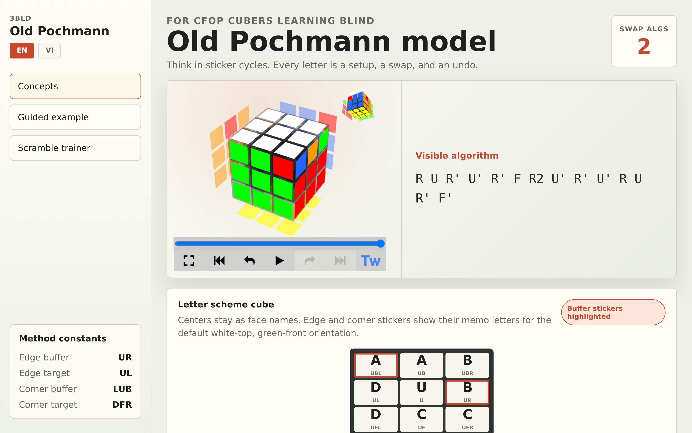
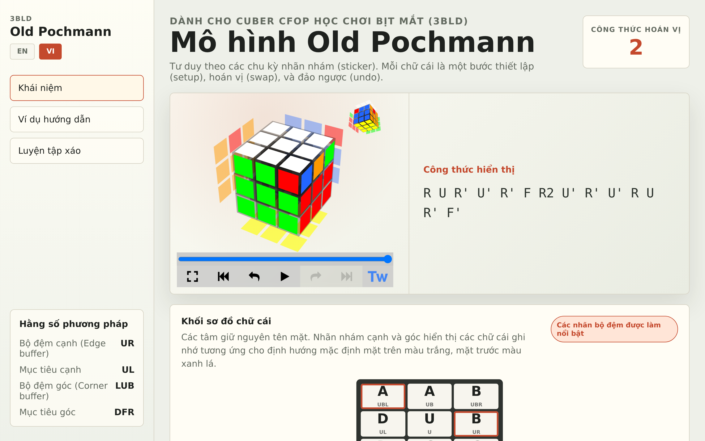
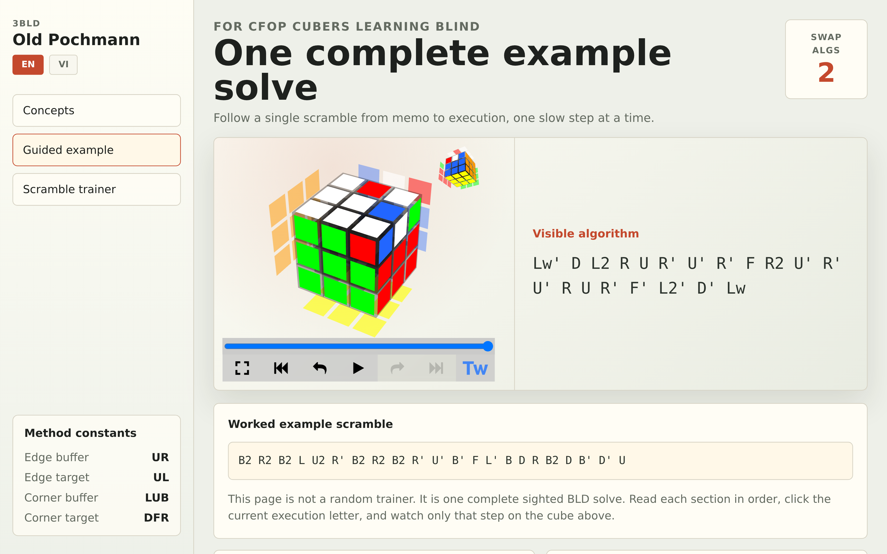
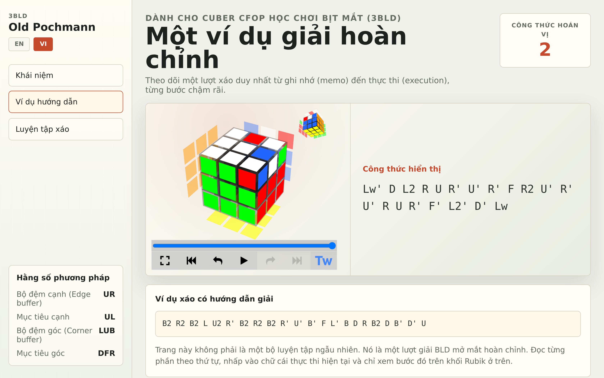
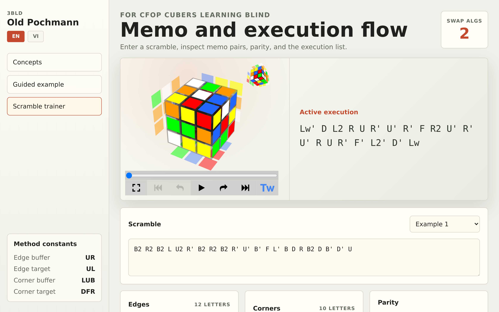

# Old Pochmann 3x3 BLD Trainer

Interactive Vite + React page for learning 3x3 blindfolded with Old Pochmann.
It assumes the learner already knows CFOP notation and focuses on BLD concepts:
buffers, sticker memo, setup-swap-undo execution, cycle breaks, flipped/twisted
pieces, parity, and full scramble practice.

## Run

```bash
npm install
npm run dev
```

Open `http://localhost:5173/`.

## Checks

```bash
npm run lint
npm run test
npm run test:e2e
npm run build
```

## Main Files

- `src/App.tsx` - learning interface, lesson modes, and 3D cube integration.
- `src/lib/oldPochmann.ts` - method constants, letter scheme, drills, and memo tracing.
- `src/lib/oldPochmann.test.ts` - unit coverage for memo helpers.
- `tests/e2e/trainer.spec.ts` - browser smoke checks for desktop and mobile.

## Screenshots

### Concepts Mode (English & Vietnamese)

| English | Vietnamese |
|---|---|
|  |  |

### Guided Example (English & Vietnamese)

| English | Vietnamese |
|---|---|
|  |  |

### Scramble Trainer (English)



